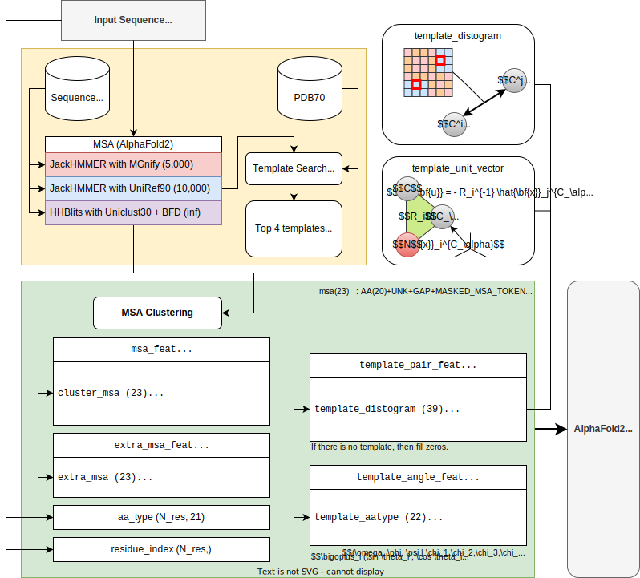
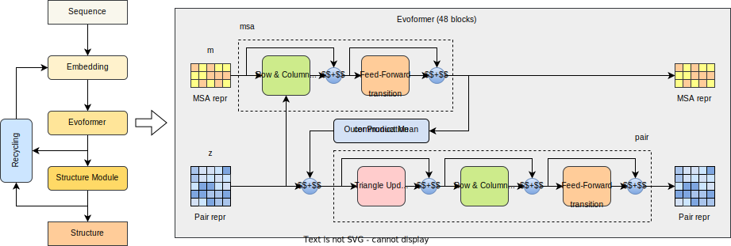

# AlphaFold2 Pipeline

---
## Generate input features

{ width="1280px" align=left loading=lazy }

AlphaFold needs time consuming input feature generation process.

---
## Artificial Neural Network

{ width="1280px" align=left loading=lazy }

This model was a collection of the latest findings on artificial neural networks through 2021.

---
## Relaxation with the physical force field

Amber ff99SB force field is used to minimize energy of the configuration which leads the atoms to physically correct positions.
