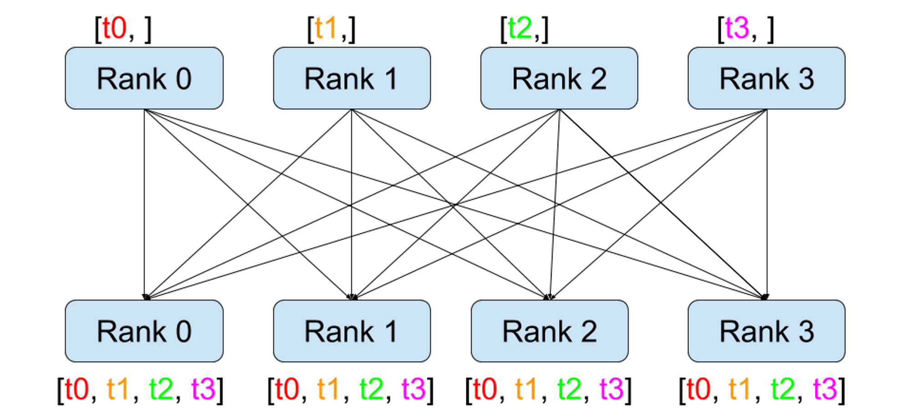

# Distributed Computing

> 백지장도 맞들면 낫다

Computer software has been written for serial computation.
To solve a problem, an algorithm is constructed and implemented as a serial stream of instructions.
These instructions are executed on a CPU on one computer.
Only one instruction may execute at a time.
Afther one instruction is fininshed, the next one is executed.

A distributed system is a system whose components are located on different networked computers, which communicate and coordinate their actions by passing messages to one another.

Consider NVIDIA's H100 GPUs (maybe the best on earth).

- 80 GB of memory is not sufficient for traning large (language) models.
- AlphaFold model induce large memory consumption due to its activations.

This is why we should introduce distributed computing.

## Message passing interface routines

### Broadcast

### Scatter

### All-Gather

### All-Reduce

### All-to-All

It is used to transpose distributed tensors.

## NCCL

The NVIDIA Collective Communications Library (NCCL, pronounced "Nickel") is a library providing inter-GPU communication primitives that are topology-aware.
NCCL is integrated to PyTorch.

## Distributed computing in DeepFold

### Motivation

Most calculations are done on hidden dimension.

### Sharding strategy

- In general, shard residue dimension. (`N->N'`.)
- For a pair representation, shard row dimension. (`[*, N, N, C] -> [*, N', N, C]`.)
- If the dimension which the layer needs it to be complete, all-gather operation is executed.
- Do all-to-all operation instead, if it is more efficient.
- Mask is not sharded.
- Pad the dimension at first.

### Example: Triangular multiplicative update

The original triangular multiplicative layer is shown in the figure.

Sharded right projection $\mathbf{b}_{ij}$ is gathered.

## Mixed strategy

Combine data parallelism and model parallelism to speed up training.

