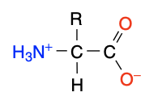
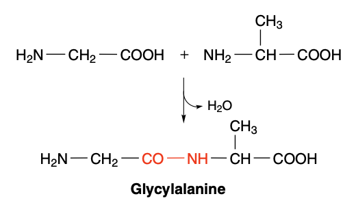

# Proteins

## Breif introduction

Proteins are most versatile macromolecules in living systems and serve crucial functions in essentially all biological processes.
They function as catalysts, transport and store other molecules such as oxygen, provide mechanical support and immune protection, generate movement, trasnmit nerve impulses, and control growth and differentiation.

*Proteins are linear polymers built of monomer units called amino acids*, which are linked end to end.
The sequence of linked amino acids is called the primary structure.
Remarkably, proteins spontaneously fold up into three-dimensional structures that are determined by the sequence of amino acids in the protein polymer.
Three-diemensional structure formed by hydrogen bonds between amino acids near one another is called secondary structure, whereas tertiary structure is formed by long-range interactions between amino acids.
Protein function depends directly on this three-dimensional structure.
Thus, *proteins are the embodiment of the transition from the one-diemnsional world of sequences to the three-dimensional world of molecules capable of diverse activities*.
Many protein also display quaternary structure, in which the functional protein is composed of several distinct polypeptide chains.

*Proteins contain a wide range of functional groups*.

*Proteins can interact with one another and with other biological macromolecules to from complex assemblies*.

*Some proteins are quite rigid, whereas other display considerable flexibility*.

## Amino acids: the building blocks of proteins

### Amino acids

Despite enormous functional diversity all proteins consist of a linear arrangement of amino acids residues assembled together into a polypeptide chain.
Amino acids are the 'building blocks' of proteins and in order to understand the properties of proteins we must first describe the properties of proteins we must first describe the properties of the constituent **20 amino acids**. All amino acids contain carbon, hydrogen, nitrogen and oxgen with two of the 20 amino acids also containing sulfur.

Throughout this document a color scheme based on the CPK (**C**orey, **P**auling and **K**ultun) model is used.

- Nitrogen: blue
- Oxygen: red
- Carbon: either black or light gray
- Sulfur: yellow
- Hydrogen: either white or a lighter shade of gray

In their isolated sate amino acids are white crystalline solids.

Amino acids are always represented as the zwitterionic state.
For 19 of the twenty amino acids commonly found in proteins a general structure for the zwitterionic state has charged amino ($\mathrm{NH_3^+}$) and carboxyl ($\mathrm{OO^-}$) groups attached to a central carbon atom called the $\alpha$ (alpha) carbon or CA.
The remaining atoms connected to the CA are a single hydrogen atom and the R group or side chain.

For the remaining amino acid, proline, an unusual cyclic ring is formed by the side chain bonding directly to the amide nitrogen.

### Peptide bonds

Amino acids are joined together by the formation of a peptide bond where the amino group of one molecule reacts with the carboxyl group of the other.
The reaction is described as a condensation resulting in the elimination of water and the formation of a dipeptide.

When joined in a series of peptide bonds amino acids are called residues to distinguish between the free form and the form found in proteins.

All proteins are made up of amino acids residues linked together in an order that is ultimately derived from the information residing within our genes.
Some proteins are clearly related to each other in that they have similar sequences whilst most proteins exhibit a very different composition of residues and a very different order of residues along the polypeptide chain.

Amino acid sequences of proteins are read from *left to right*. This is *from the amino or N terminal to the carboxyl or C terminal*.
The individual amino acids have three-letter codes, but increasingly, in order to save space in the presentation of long protein sequences, a single-letter code is used for each amino acid residue.

| 1 | 3   | Name          |
|:-:|:---:|---------------|
| A | ALA | Alanine       |
| R | ARG | Arginine      |
| N | ASN | Asparagine    |
| D | ASP | Aspartate     |
| C | CYS | Cysteine      |
| Q | GLN | Glutamine     |
| E | GLU | Glutamate     |
| G | GLY | Glycine       |
| H | HIS | Histidine     |
| I | ILE | Isoleucine    |
| L | LEU | Leucine       |
| K | LYS | Lysine        |
| M | MET | Methionine    |
| F | PHE | Phenylalanine |
| P | PRO | Proline       |
| S | SER | Serine        |
| T | THR | Threonine     |
| W | TRP | Tryptophan    |
| Y | TYR | Tyrosine      |
| V | VAL | Valine        |

## The three-dimensional structure of proteins

### Primary structure or sequence

### Secondary structure

#### Alpha helix

#### Other helical conformations

#### The beta strand

#### Turns as elements of secondary structure

#### Additional secondary structure

#### The Ramachandran plot

### Tertiary structure

#### Interactions stabilizing tertiary structure

- Disulfide briges
- The Hydrophobic effect
- Charge-charge interactions
- Hydrogen bonding
- Van der Waals interactions

### The organization of proteins into domains

### Quaternary structure
